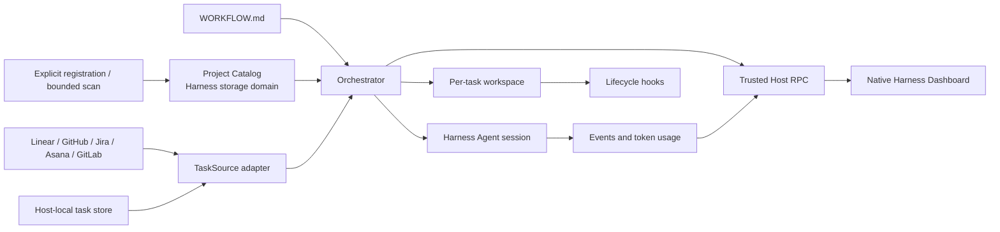

# dsh-dashboard

English | [简体中文](./README.zh-CN.md)

`dsh-dashboard` is a Symphony-compatible task orchestrator and operational board for [DeepSeek Harness](https://github.com/deepseek-ai/deepseek-harness). It turns tasks from Linear, GitHub, Jira, Asana, GitLab, or a Host-local task store into isolated Harness Agent runs while preserving the native Harness shell, sidebar, sessions, tools, model selection, and permission system.


## Features

- Loads a `WORKFLOW.md` with YAML frontmatter and a Liquid prompt. Invalid hot reloads are rejected while the last valid definition remains active.
- Supports Linear, GitHub Issues, Jira Cloud, Asana projects, GitLab project issues, and credential-free local tasks.
- Applies deterministic priority ordering, required labels, global concurrency, and per-state concurrency limits.
- Creates one persistent workspace per task and runs configurable `after_create`, `before_run`, `after_run`, and `before_remove` lifecycle hooks.
- Runs through native Harness Agents and continues the same Harness session up to the configured turn limit.
- Retries failed runs with bounded exponential backoff and rechecks source state before every dispatch.
- Adds a **Dashboard** entry to the native Harness sidebar. Board, Runtime, Projects, and Configuration expose task state, session, workspace, turns, tokens, Agent events, retries, blockers, registered projects, and credential health.
- Maintains a durable Project Catalog in Harness storage. Projects can be registered explicitly or discovered within bounded roots; scanned candidates are never registered without confirmation.
- Models a Project separately from its Git Repository. Git projects use a worktree workspace strategy, while non-Git projects use controlled directories; autonomous task claims remain off.
- Shows Linear-style `+` controls for the **Local** source, with create, edit, state, priority, description, and delete operations backed by an atomic Host-side JSON store.
- Keeps external credentials on the trusted Host; credential values never enter Dashboard RPC payloads or browser state.

The `Provider · Project` control beside the Dashboard title is dynamic. Examples include `Linear · ENG`, `GitHub · openai/example`, and `Local · Personal`.

## Provider support

| Provider | Task identity | Dashboard state source | Host credentials | Agent tool |
| --- | --- | --- | --- | --- |
| Linear | Project issues | Native Linear workflow state | API key | `linear_graphql` |
| GitHub | Repository issues; pull requests are excluded | Configured state labels; open/closed fallback | Fine-grained or classic token | `github_api` |
| Jira Cloud | Project issues selected with enhanced JQL | Native Jira status | Account email + API token | `jira_api` |
| Asana | Tasks in one project | Project section; completed tasks use a terminal state | Personal access token | `asana_api` |
| GitLab | Issues in one project | Configured state labels; opened/closed fallback | Personal/project access token | `gitlab_api` |
| Local | Tasks in one named local project | States declared in `WORKFLOW.md` | None | `local_task` |

Only one task source is active for a `WORKFLOW.md`. Switching `tracker.kind` changes the board context and scheduler source after the validated workflow reload succeeds.

## How it works



The Host plugin owns provider access, scheduling, workspaces, hooks, Agent sessions, Project Catalog persistence, local-task persistence, and runtime state. The browser receives a constrained state projection and exposes only pause/resume, stop, refresh, Catalog operations, and Local task mutations.

## Requirements

- Node.js `22.19+` or `24+`
- pnpm `11.19+` for source builds
- DeepSeek Harness Web profile `0.1.0-rc.6`
- An existing Harness permission preset; the bundled row uses `workspace-write`
- Credentials for the selected remote provider, or no credentials for Local tasks

This repository compiles and tests against the published Harness `0.1.0-rc.6` packages. See [Compatibility](./docs/compatibility.md) for the reviewed interface boundary.

## Installation

### npm

```powershell
dsh plugin --profile web add dsh-dashboard@0.11.0
dsh web --dump-config
dsh web
```

Without a global CLI:

```powershell
npx --yes @deepseek-ai/dsh@0.1.0-rc.6 plugin --profile web add dsh-dashboard@0.11.0
npx --yes @deepseek-ai/dsh@0.1.0-rc.6 web --dump-config
npx --yes @deepseek-ai/dsh@0.1.0-rc.6 web
```

The npm package contains prebuilt Host and browser entries and does not require install-time build permission.

### Source or tarball

```powershell
pnpm install --ignore-scripts
pnpm run typecheck
pnpm test
pnpm run build
Copy-Item -LiteralPath WORKFLOW.example.md -Destination WORKFLOW.md
pnpm pack
dsh plugin --profile web add ./dsh-dashboard-0.11.0.tgz
dsh web
```

Open the address printed by `dsh web`, then select **Dashboard** in the native Harness sidebar.

To uninstall:

```powershell
dsh plugin --profile web remove dsh-dashboard
```

## Plugin configuration

The package provides a standard `dsh.bundle.patch`; defaults live in [cordis.patch.yml](./cordis.patch.yml).

| Setting | Purpose |
| --- | --- |
| `currentProject.root` | Harness-selected project root. Relative paths resolve from the Harness process directory. |
| `currentProject.policyPath` | Project `WORKFLOW.md`, resolved from `currentProject.root`. |
| `currentProject.registerInCatalog` | Registers the selected workspace in the Project Catalog at startup. |
| `agentProfile.id` | Stable profile id referenced by `project.agent_profile` in the project policy. |
| `agentProfile.permissionPreset` | Explicit Harness permission preset applied to orchestrated Agents. Required. |
| `agentProfile.agentPreset` | Optional Harness Agent preset; omission selects the available roster default. |
| `agentProfile.workerHost` | Host label shown in runtime observability. Defaults to `local`. |
| `policyDefaults.*` | Global defaults for polling, workspace root, hook timeout, concurrency, turns, and retry backoff. A project's `policy` block may override them. |
| `discovery.roots` | Bounded scan roots seeded into the Project Catalog. Each entry has an absolute `path` and `maxDepth` from 1 to 8. |
| `linear.endpoint` / `linear.apiKeyRef` | Linear GraphQL endpoint and API-key reference. |
| `github.endpoint` / `github.tokenRef` | GitHub REST endpoint and token reference; the endpoint can target GitHub Enterprise. |
| `jira.emailRef` / `jira.apiTokenRef` | Jira Cloud account-email and API-token references. The site URL belongs in `WORKFLOW.md`. |
| `asana.endpoint` / `asana.tokenRef` | Asana REST endpoint and token reference. |
| `gitlab.endpoint` / `gitlab.tokenRef` | GitLab API v4 endpoint and token reference. Override the endpoint for self-managed GitLab. |
| `local.storePath` | Host-side JSON task store. Defaults to `~/.dsh-dashboard/tasks.json`. |

Example Web profile override:

```yaml
- id: dsh-dashboard
  config:
    currentProject:
      root: C:\work\my-project
      policyPath: WORKFLOW.md
      registerInCatalog: true
    agentProfile:
      id: default
      permissionPreset: workspace-write
      workerHost: workstation-01
    policyDefaults:
      pollingIntervalMs: 5000
      workspaceRoot: .dsh-dashboard/workspaces
      hookTimeoutMs: 60000
      maxConcurrentAgents: 10
      maxTurns: 20
      maxRetryBackoffMs: 300000
    discovery:
      roots:
        - path: C:\work
          maxDepth: 4
    github:
      tokenRef: GITHUB_TOKEN
      endpoint: https://api.github.com
    jira:
      emailRef: JIRA_EMAIL
      apiTokenRef: JIRA_API_TOKEN
    gitlab:
      tokenRef: GITLAB_TOKEN
      endpoint: https://gitlab.example.com/api/v4
    local:
      storePath: C:\work\dsh-dashboard\tasks.json
```

`agentProfile.permissionPreset` is deliberately explicit: unattended orchestration must never silently select or elevate a sandbox or approval policy. Project discovery does not authorize execution; every stored Project has autonomous claims disabled.

## Credentials

Set only the references needed by the active provider:

```powershell
$env:LINEAR_API_KEY = 'lin_api_replace_me'
$env:GITHUB_TOKEN = 'github_pat_replace_me'
$env:JIRA_EMAIL = 'user@example.com'
$env:JIRA_API_TOKEN = 'replace_me'
$env:ASANA_ACCESS_TOKEN = 'replace_me'
$env:GITLAB_TOKEN = 'glpat-replace_me'
dsh web
```

The same names can be stored in `$DSH_HOME/.credentials.yaml`:

```yaml
LINEAR_API_KEY: lin_api_replace_me
GITHUB_TOKEN: github_pat_replace_me
JIRA_EMAIL: user@example.com
JIRA_API_TOKEN: replace_me
ASANA_ACCESS_TOKEN: replace_me
GITLAB_TOKEN: glpat_replace_me
```

Do not commit that file, real tokens, or logs containing credentials. Each provider resolves its references at operation time. Dashboard displays only the reference name, configuration status, and credential source.

## WORKFLOW.md

Start with the Linear-oriented [WORKFLOW.example.md](./WORKFLOW.example.md) or a provider-specific example:

- [GitHub](./examples/WORKFLOW.github.md)
- [Jira](./examples/WORKFLOW.jira.md)
- [Asana](./examples/WORKFLOW.asana.md)
- [GitLab](./examples/WORKFLOW.gitlab.md)
- [Local tasks](./examples/WORKFLOW.local.md)

Common fields:

| Field | Description |
| --- | --- |
| `version` | Policy schema version. The current format requires `1`. |
| `project.name` | Human-readable Project name shown in Configuration. |
| `project.agent_profile` | Agent Profile id; it must exactly match the configured `agentProfile.id`. |
| `tracker.kind` | `linear`, `github`, `jira`, `asana`, `gitlab`, or `local`. |
| `tracker.provider.context_label` | Optional short project label beside the Dashboard title. |
| `tracker.required_labels` | Labels that must all be present before dispatch. |
| `tracker.active_states` | States eligible for Agent execution. |
| `tracker.terminal_states` | States that stop execution and trigger safe workspace cleanup. |
| `policy.polling.interval_ms` | Project override for the global polling interval. |
| `policy.workspace.root` | Parent directory containing one persistent workspace per task. Relative paths resolve from the policy file's directory. |
| `policy.hooks.timeout_ms` | Timeout applied independently to each lifecycle hook. |
| `policy.agent.max_concurrent_agents` | Project Agent concurrency limit. |
| `policy.agent.max_concurrent_agents_by_state` | Optional concurrency limits for individual source states. |
| `policy.agent.max_turns` | Maximum turns continued in one Harness session. |
| `policy.agent.max_retry_backoff_ms` | Upper bound for retry backoff. |
| `policy.dashboard.visible_states` | Board columns shown before the Hidden columns group. |

Provider routing fields:

| Provider | Required fields | Optional routing |
| --- | --- | --- |
| Linear | `project_slug` | `assignee: me` or a Linear assignee id |
| GitHub | `owner`, `repo` | `assignee`, `state_labels` |
| Jira | `site_url`, `project_key` | `assignee: me` or account id, additional `jql` |
| Asana | `project_gid` | `assignee: me` or user gid |
| GitLab | `project_id` as numeric id or namespace path | `assignee`, `state_labels` |
| Local | `project_id` defaults to `local` | `context_label` |

For GitHub and GitLab, `state_labels` maps workflow-state names to provider labels. A label whose name directly equals a declared state is also recognized. Opened issues without a matching label fall back to the first active state; closed issues without a matching terminal label fall back to the first terminal state.

Jira uses native status names. Asana uses the task's section in the configured project; completed Asana tasks use the first terminal state.

The Liquid prompt can reference `issue.identifier`, `issue.title`, `issue.description`, `issue.state`, `issue.labels`, `issue.url`, and the retry `attempt`.

### Local task controls

When `tracker.kind` is `local`, each visible column header shows a `+` button. New tasks are created directly in the selected column. Opening a card exposes edit and delete controls; title, description, state, and priority are editable.

Local tasks are persisted by the Host, not `localStorage`. Writes are serialized and committed through a same-directory temporary file and atomic rename. Dashboard edits use the task's opened revision and are rejected if an Agent or another editor has already changed it. A malformed or unsupported store is rejected instead of being overwritten. Dashboard deletion removes only the task record; an existing Agent workspace is preserved.

### Lifecycle hooks

- `after_create` runs only after a new task workspace is created.
- `before_run` runs before every Agent attempt.
- `after_run` runs after an Agent attempt while the workspace still exists.
- `before_remove` runs before terminal workspace cleanup.

Hooks run as trusted local commands inside the task workspace. Review them with the same care as build or deployment scripts.

For a Git current project, the workspace is already a detached worktree of the selected repository before `after_create` runs; do not clone the repository again in that hook. A non-Git current project receives a controlled empty directory that `after_create` may initialize explicitly.

## Scheduling and workspace safety

- Eligible tasks are ordered by priority, creation time, and identifier.
- Linear `blocks` relations and Jira “is blocked by” links are projected as blockers when available.
- Missing tasks stop running without being classified as terminal, so a transient query or provider change does not delete their workspace.
- Workspace identifiers are normalized and containment-checked before filesystem mutation.
- Workspace roots and task directories must be real directories, not symbolic links.
- Deletion targets are resolved again after `before_remove`; cleanup is refused if the root or target changed while the hook ran.
- A failed `after_create` removes the incomplete workspace so a later attempt can initialize it again.
- Runtime claims and workspace names include the provider project scope, so equal issue numbers in different repositories or projects remain isolated.
- Hook stdout and stderr are retained as bounded tails.
- Remote Agent tools keep endpoints and credentials on the Host and restrict operations to the configured repository, project, or issue namespace where the provider API permits it.

See [Security](./docs/security.md) and [Architecture](./docs/architecture.md) for the complete trust model and component boundaries.

## Dashboard

The plugin registers through Harness-native UI slots:

- `sidebar.footer.action` adds the Dashboard entry to the existing Harness sidebar.
- `shell.overlay` renders the Dashboard in the main Harness content area.

The plugin does not replace or duplicate the Harness sidebar.

Dashboard copy is integrated with Harness's native locale service. Simplified Chinese and English dictionaries are type-checked against the same key set, and the active language follows the persisted **Settings → Language** preference. When no Host preference exists, Harness derives the initial language from the browser. Tracker-owned content such as issue titles, workflow state names, and Agent messages remains in its source language.

Simplified Chinese Dashboard running inside DeepSeek Harness:


- **Board** — source-native task columns, hidden states, filtering, Local task controls, and task inspection.
- **Runtime** — running, retrying, and blocked records with turns, token usage, worker host, and update time.
- **Projects** — durable registered Projects and separate Repository metadata, workspace strategy, current-workspace marker, discovery roots, bounded scans, and explicit candidate confirmation.
- **Configuration** — last-good workflow, provider context, each credential reference's health, workspace root, polling, permission preset, and Agent limits.

The execution surface remains bound to the Harness-selected `currentProject`. Registering or discovering another Project makes it available in the Catalog but does not enable autonomous cross-project task claims.

Durable Project Catalog loaded through the native Harness Dashboard entry:


Bounded discovery keeps candidates behind an explicit review step:


Portfolio-style Local task board loaded through the native Harness Dashboard entry. This single current Project demonstrates cross-domain planning, active work, human review, rework/merging, and terminal nodes without implying autonomous cross-project claims:


Task inspection keeps the selected card, source state, workspace, Agent activity, tokens, and recent events in one board context:


Create and edit Local tasks without an external Tracker:


## Development and verification

```powershell
pnpm run typecheck
pnpm test
pnpm run build
```

For deterministic component development:

```powershell
pnpm run dev:dashboard
```

`http://127.0.0.1:4173/dev/` uses local fixture data, renders the UI in Chinese by default, and is useful for component-level visual and interaction checks. It is not evidence that the packaged plugin loads correctly in Harness.

Integration verification must build or pack the plugin, install that artifact into a Harness Web profile, start `dsh web` from a dedicated workspace, enter Dashboard from the native sidebar, and check provider data, Local mutations, browser console output, and Host logs.

Design references are kept in [docs/design](./docs/design/README.md).

## Upstream API references

- [GitHub Issues REST API](https://docs.github.com/en/rest/issues/issues)
- [Jira Cloud REST v3 enhanced issue search](https://developer.atlassian.com/cloud/jira/platform/rest/v3/api-group-issue-search/)
- [Asana tasks in a project](https://developers.asana.com/reference/gettasksforproject)
- [GitLab Issues API](https://docs.gitlab.com/api/issues/)

## Relationship to Symphony

This project reproduces Symphony's orchestration contract rather than embedding its Elixir/OTP implementation:

- `TaskSource` is the provider boundary.
- `HarnessAgentRunner` maps execution and continuation onto native Harness sessions.
- Persistent per-task workspaces and lifecycle hooks follow Symphony-compatible semantics with additional fail-closed filesystem checks.
- Trusted Host RPC projects observable state and bounded controls into the browser.
- The UI combines Symphony's operational signals with a Linear-style board inside the native Harness shell.

Upstream reference: [openai/symphony](https://github.com/openai/symphony).

## License

[MIT](./LICENSE)
